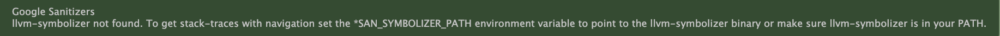
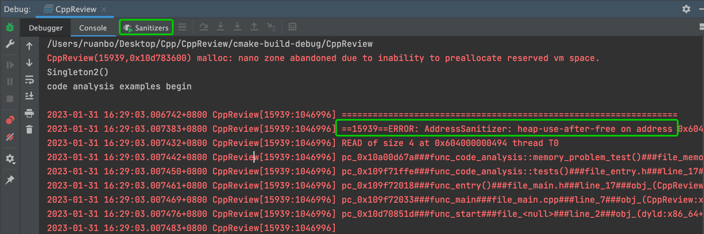

    google sanitizers(https://github.com/google/Sanitizers) is a open source tool implemented by google, used for code analysis.
    sanitizers is implemented by Clang(since 3.1) and GCC(since 4.8)

## tool lists
* AddressSanitizer(ASan): detects address-ability
    + -fsanitize=address
    + g++
    ```
    g++ -fsanitize=address
    ```
    + CMakeLists
    ```
    SET(CMAKE_CXX_FLAGS "${CMAKE_CXX_FLAGS} -fsanitize=address")
    ```
* LeakSanitizer(LSan): detects memory leaks
    + -fsanitize=leak
* ThreadSanitizer(TSan): detects data races and deadlocks for C++ and Go
    + -fsanitize=thread
* MemorySanitizer(MSan): detects use of un-initialized memory
    + -fsanitize=memory
* UndefinedBehaviorSanitizer(UBSan): detects undefined behavior
    + -fsanitize=undefined


## use sanitizes in Clion on MacOS
https://www.jetbrains.com/help/clion/google-sanitizers.html#makefiles-compdb

* llvm-symbolizer not found.

  install llvm
  ```
  brew install llvm
  ```
  add and llvm path(/usr/local/Cellar/llvm/13.0.1_1/bin) to system PATH in ~/.bash_profile
    ```
    export PATH=$PATH:/usr/local/Cellar/llvm/13.0.1_1/bin
    ```

* add -fsanitize=address in CMakeLists.txt
  ```
  SET(CMAKE_CXX_FLAGS "${CMAKE_CXX_FLAGS} -fsanitize=address")
  ```

* run code in clion and the console will show the error messages. Also, a new console window Sanitizers will be added.


